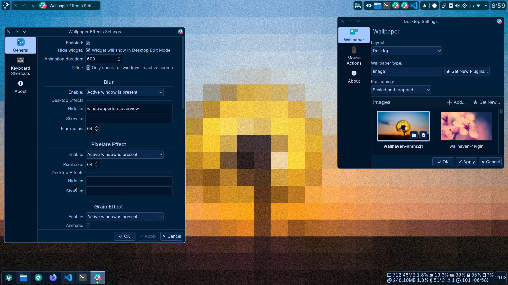

<div align="center">

# KDE Wallpaper Effects

[](https://aur.archlinux.org/packages/plasma6-applets-wallpaper-effects)
[&color=1f425f&labelColor=2d333b&logo=kde&label=KDE%20Store)](https://store.kde.org/p/2145723)
[&logo=fedora&label=Fedora%2043&color=1f425f&labelColor=2d333b)](https://software.opensuse.org//download.html?project=home%3Aluisbocanegra&package=plasma-wallpaper-effects)
[&logo=fedora&label=Fedora%20Rawhide&color=1f425f&labelColor=2d333b)](https://software.opensuse.org//download.html?project=home%3Aluisbocanegra&package=plasma-wallpaper-effects)
[&logo=opensuse&label=openSUSE%20Tumbleweed&color=1f425f&labelColor=2d333b)](https://software.opensuse.org//download.html?project=home%3Aluisbocanegra&package=plasma-wallpaper-effects)
[&logo=opensuse&label=openSUSE%20Slowroll&color=1f425f&labelColor=2d333b)](https://software.opensuse.org//download.html?project=home%3Aluisbocanegra&package=plasma-wallpaper-effects)

Plasma Widget to enable Active Blur and other effects for all Wallpaper Plugins


</div>

Inspired by the [Zren/inactiveblur](https://github.com/Zren/plasma-wallpapers/tree/master/inactiveblur) ([bouteillerAlan/blurredwallpaper](https://github.com/bouteillerAlan/blurredwallpaper) for plasma 6) but packed into a widget to work with any Wallpaper Plugin.

## Demo

[](https://www.youtube.com/watch?v=fdTAewwZLVs) (outdated)

<details>
    <summary>Screenshots</summary>


</details>

## Features

### Blur

- Radius

### Rounded corners

- Radius
- Background color
- Margins (top, bottom, left, right)
- Shadow

### Color effects

- Colorization
- Brightness
- Contrast
- Saturation

### Toggle effects on

- Maximized or full-screen window
- Active window
- Window is present
- Always
- Never
- Desktop Effects (overview, windowaperture...)

### Pixelate (shader)

- Pixel size

### Grain filter (shader)

- Animate
- Grain size
- Grain amount

- [ ] You tell me

## Installing

### Arch Linux

[aur/plasma6-applets-wallpaper-effects](https://aur.archlinux.org/packages/plasma6-applets-wallpaper-effects) use your preferred AUR helper (e.g `yay -S plasma6-applets-wallpaper-effects`)

### openSUSE Build Service packages (Fedora, openSUSE)

Maintained with @pallaswept and me at <https://build.opensuse.org/package/show/home:luisbocanegra/plasma-wallpaper-effects>

Install instructions: <https://software.opensuse.org//download.html?project=home%3Aluisbocanegra&package=plasma-wallpaper-effects>

### KDE Store

Install the plugin from the KDE Store [Plasma 6 version](https://store.kde.org/p/2145723)

1. **Right click on the Desktop** > **Edit Mode** > **Add Widgets** > **Get New Widgets** > **Download new...**
2. **Search** for "**Wallpaper Effects**", install and add it to your Desktop.

### Manually

  1. Install these dependencies or their equivalents for your distribution

      ```txt
      cmake extra-cmake-modules libplasma plasma5support
      ```

  2. Run

      ```sh
      git clone https://github.com/luisbocanegra/plasma-wallpaper-effects
      cd plasma-wallpaper-effects
      ./install.sh
      ```

## How to use

1. Put the widget on any of your Desktops
2. Go to the widget settings to change the effects and behavior
3. Widget can set to only show in **Desktop Edit Mode** (right click > Hide widget or from the widget settings)

### Restore the original desktop appearance

Changes to the Desktop are not permanent and can be removed by disabling them from **Widget Settings** > **General tab** > **Enabled** checkbox or removing the widget from the Desktop.

## Translations

Instructions to translate the project are available [here](https://github.com/luisbocanegra/plasma-wallpaper-effects/blob/main/package/translate/ReadMe.md)

## How does it work

Similar to [plasma-panel-colorizer](https://github.com/luisbocanegra/plasma-panel-colorizer), this widget works by injecting/managing effects of the existing wallpaper. Replicating the famous Active Blur for all Wallpaper Plugins without having to modify each wallpaper plugin source code.

## Support the development

If you like the project please consider donating/sponsoring this and [my other open source work](https://github.com/luisbocanegra?tab=repositories&q=&type=source&language=&sort=stargazers)

[](https://github.com/sponsors/luisbocanegra) [](https://ko-fi.com/luisbocanegra) [](https://www.buymeacoffee.com/luisbocanegra) [](https://liberapay.com/luisbocanegra/) [](https://www.paypal.com/donate/?hosted_button_id=Y5TMH3Z4YZRDA)

## Acknowledgements

- [Zren/inactiveblur](https://github.com/Zren/plasma-wallpapers/tree/master/inactiveblur) [bouteillerAlan/blurredwallpaper](https://github.com/bouteillerAlan/blurredwallpaper)

- [Search the actual gridLayout of the panel from Plasma panel spacer](https://invent.kde.org/plasma/plasma-workspace/-/blob/Plasma/5.27/applets/panelspacer/package/contents/ui/main.qml?ref_type=heads#L37) code that inspired this project.

- [Google LLC. / Pictogrammers](https://pictogrammers.com/library/mdi/) for the icons.

## Screenshots

Configuration


Effects demo


